* Table of Contents
{:toc}

--------------------------------------------------------------------------------------------------------------------

## **Acknowledgements**

* {list here sources of all reused/adapted ideas, code, documentation, and third-party libraries -- include links to the original source as well}

--------------------------------------------------------------------------------------------------------------------

## **Setting up, getting started**

Refer to the guide [_Setting up and getting started_](SettingUp.md).

--------------------------------------------------------------------------------------------------------------------

## **Design**

:bulb: **Tip:** The `.puml` files used to create diagrams in this document `docs/diagrams` folder. Refer to the [_PlantUML Tutorial_ at se-edu/guides](https://se-education.org/guides/tutorials/plantUml.html) to learn how to create and edit diagrams.

### Architecture

The ***Architecture Diagram*** given above explains the high-level design of the App.

Given below is a quick overview of main components and how they interact with each other.

**Main components of the architecture**

**`Main`** (consisting of classes [`Main`](https://github.com/se-edu/addressbook-level3/tree/master/src/main/java/seedu/address/Main.java) and [`MainApp`](https://github.com/se-edu/addressbook-level3/tree/master/src/main/java/seedu/address/MainApp.java)) is in charge of the app launch and shut down.
* At app launch, it initializes the other components in the correct sequence, and connects them up with each other.
* At shut down, it shuts down the other components and invokes cleanup methods where necessary.

The bulk of the app's work is done by the following four components:

* [**`UI`**](#ui-component): The UI of the App.
* [**`Logic`**](#logic-component): The command executor.
* [**`Model`**](#model-component): Holds the data of the App in memory.
* [**`Storage`**](#storage-component): Reads data from, and writes data to, the hard disk.

[**`Commons`**](#common-classes) represents a collection of classes used by multiple other components.

**How the architecture components interact with each other**

The *Sequence Diagram* below shows how the components interact with each other for the scenario where the user issues the command `delete 1`.

Each of the four main components (also shown in the diagram above),

* defines its *API* in an `interface` with the same name as the Component.
* implements its functionality using a concrete `{Component Name}Manager` class (which follows the corresponding API `interface` mentioned in the previous point.

For example, the `Logic` component defines its API in the `Logic.java` interface and implements its functionality using the `LogicManager.java` class which follows the `Logic` interface. Other components interact with a given component through its interface rather than the concrete class (reason: to prevent outside component's being coupled to the implementation of a component), as illustrated in the (partial) class diagram below.

The sections below give more details of each component.

### UI component

The **API** of this component is specified in [`Ui.java`](https://github.com/se-edu/addressbook-level3/tree/master/src/main/java/seedu/address/ui/Ui.java)

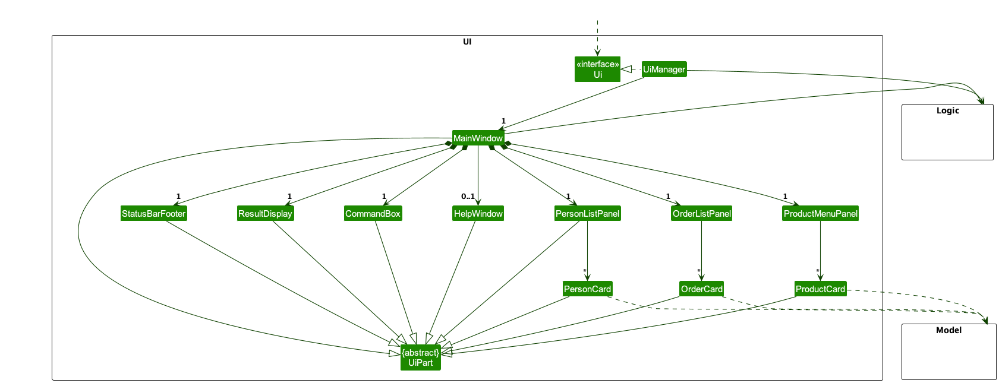

The UI consists of a `MainWindow` that is made up of parts e.g.`CommandBox`, `ResultDisplay`, `PersonListPanel`, `StatusBarFooter` etc. All these, including the `MainWindow`, inherit from the abstract `UiPart` class which captures the commonalities between classes that represent parts of the visible GUI.

The `UI` component uses the JavaFx UI framework. The layout of these UI parts are defined in matching `.fxml` files that are in the `src/main/resources/view` folder. For example, the layout of the [`MainWindow`](https://github.com/se-edu/addressbook-level3/tree/master/src/main/java/seedu/address/ui/MainWindow.java) is specified in [`MainWindow.fxml`](https://github.com/se-edu/addressbook-level3/tree/master/src/main/resources/view/MainWindow.fxml)

The `UI` component,

* executes user commands using the `Logic` component.
* listens for changes to `Model` data so that the UI can be updated with the modified data.
* keeps a reference to the `Logic` component, because the `UI` relies on the `Logic` to execute commands.
* depends on some classes in the `Model` component, as it displays `Person` and `Order` objects residing in the `Model`.

### Logic component

**API** : [`Logic.java`](https://github.com/se-edu/addressbook-level3/tree/master/src/main/java/seedu/address/logic/Logic.java)

Here's a (partial) class diagram of the `Logic` component:

The sequence diagram below illustrates the interactions within the `Logic` component, taking `execute("delete c/1")` API call as an example.

:information_source: **Note:** The lifeline for `DeleteCommandParser` and `DeleteCustomerCommandParser` should end at the destroy marker (X) but due to a limitation of PlantUML, the lifeline continues till the end of diagram.

How the `Logic` component works:

1. When `Logic` is called upon to execute a command, it is passed to an `AddressBookParser` object which in turn creates a parser that matches the command (e.g., `DeleteCommandParser`) and uses it to parse the command.
1. This results in a `Command` object (more precisely, an object of one of its subclasses e.g., `DeleteCustomerCommand` and `DeleteCustomerCommandParser`) which is executed by the `LogicManager`.
1. The command can communicate with the `Model` when it is executed (e.g. to delete a person). 
   Note that although this is shown as a single step in the diagram above (for simplicity), in the code it can take several interactions (between the command object and the `Model`) to achieve.
1. The result of the command execution is encapsulated as a `CommandResult` object which is returned back from `Logic`.

Here are the other classes in `Logic` (omitted from the class diagram above) that are used for parsing a user command:

How the parsing works:
* When called upon to parse a user command, the `AddressBookParser` class creates an `XYZCommandParser` (`XYZ` is a placeholder for the specific command name e.g., `AddCommandParser`) which uses the other classes shown above to parse the user command and create a `XYZCommand` object (e.g., `AddCommand`) which the `AddressBookParser` returns back as a `Command` object.
* All `XYZCommandParser` classes (e.g., `AddCommandParser`, `DeleteCommandParser`, ...) inherit from the `Parser` interface so that they can be treated similarly where possible e.g, during testing.

### Model component
**API** : [`Model.java`](https://github.com/se-edu/addressbook-level3/tree/master/src/main/java/seedu/address/model/Model.java)

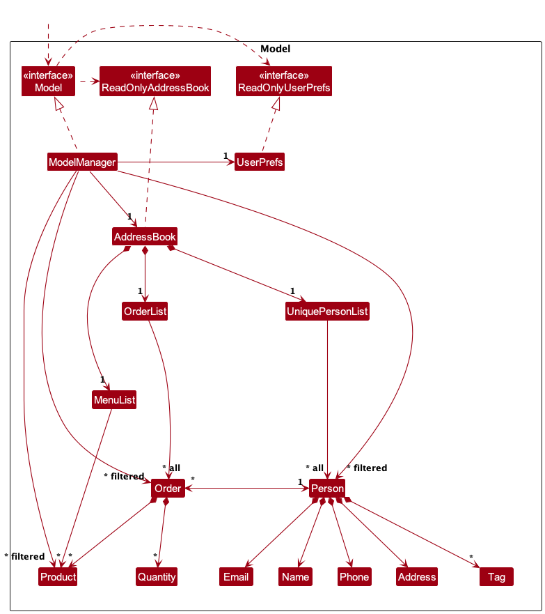

The `Model` component,

* stores the address book data i.e., all `Person`, `Order` and `Product` objects (which are contained in a `UniquePersonList`, an `OrderList` and a `MenuList` object).
* stores the currently 'selected' `Person`, `Order` and `Product` objects (e.g., results of a search query) as a separate _filtered_ list which is exposed to outsiders as an unmodifiable `ObservableList<Person>`, `ObservableList<Order>` and `ObservableList<Product>` that can be 'observed' e.g. the UI can be bound to this list so that the UI automatically updates when the data in the list change.
* stores a `UserPref` object that represents the user’s preferences. This is exposed to the outside as a `ReadOnlyUserPref` objects.
* does not depend on any of the other three components (as the `Model` represents data entities of the domain, they should make sense on their own without depending on other components)

:information_source: **Note:** An alternative (arguably, a more OOP) model is given below. It has a `Tag` list in the `AddressBook`, which `Person` references. This allows `AddressBook` to only require one `Tag` object per unique tag, instead of each `Person` needing their own `Tag` objects. 

### Storage component

**API** : [`Storage.java`](https://github.com/se-edu/addressbook-level3/tree/master/src/main/java/seedu/address/storage/Storage.java)

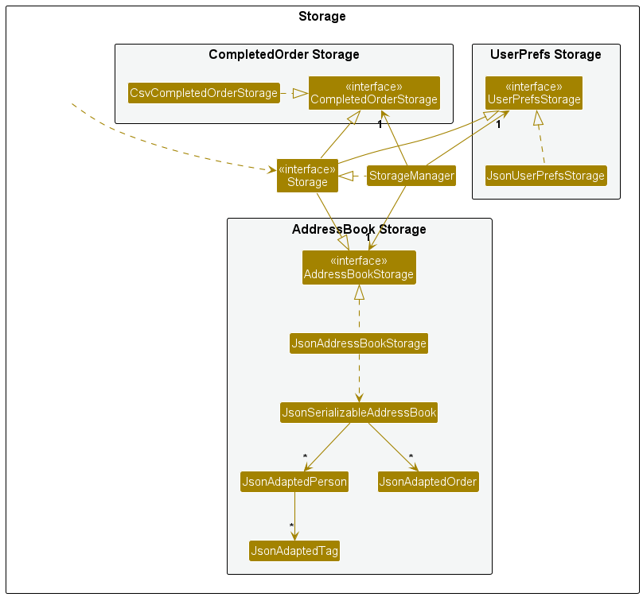

The `Storage` component,
* can save both address book data and user preference data in JSON format, and read them back into corresponding objects.
* can save completed order data in CSV format.
* inherits from `AddressBookStorage`, `CompletedOrderStorage` and `UserPrefStorage`, which means it can be treated as any of the three (if only the functionality of only one is needed).
* depends on some classes in the `Model` component (because the `Storage` component's job is to save/retrieve objects that belong to the `Model`)

### Common classes

Classes used by multiple components are in the `seedu.addressbook.commons` package.

--------------------------------------------------------------------------------------------------------------------

## **Implementation**

This section describes some noteworthy details on how certain features are implemented.

### Removing order feature

#### Implementation

Removes an `Order` from the `OrderList` by its index. Example: `cancel 19`.
The sequence of events is illustrated by the diagram below, starting with parsing of the command.
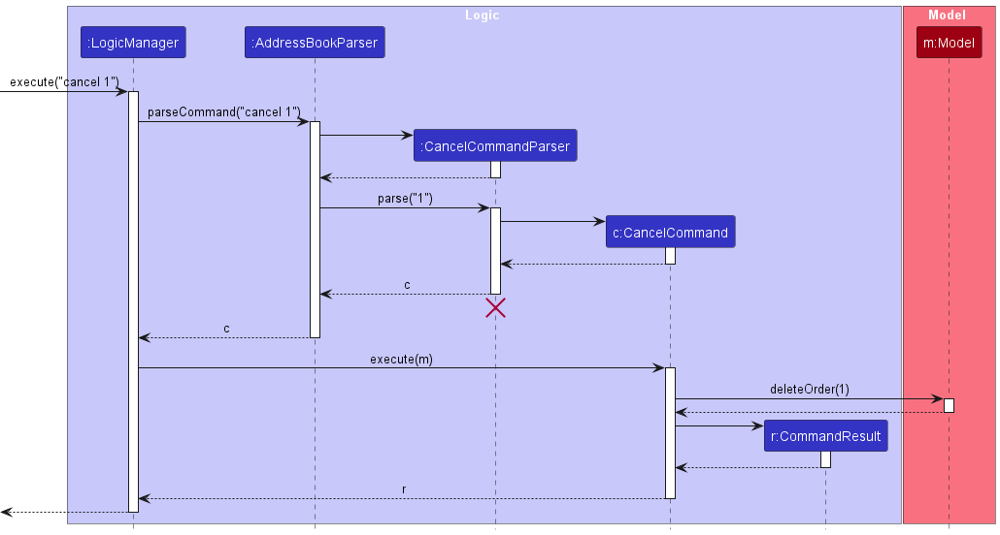
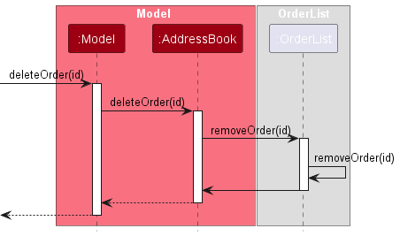

After parsing the `cancel` command, the `LogicManager` will call the `Model#deleteOrder(id)` which calls
`AddressBook#deleteOrder(id)`. The `Order` instance will then call its own `removeOrder(id)` which will remove this order from the customer's `ArrayList<Order>`.

### Find customer or order feature

#### Implementation

`FindOrderCommand` and `FindPersonCommand` extends the `FindCommand` abstract class. The `PREFIX_ORDER` after the `find` command will create a `FindOrderCommand` while any other valid prefixes will create a `FindPersonCommand`.

`FindCommandParser` will construct the respective command with the relevant predicates.
1. If `PREFIX_ORDER`, a `FindOrderCommand` with a `MatchingOrderIndexPredicate` will be created.
2. If `PREFIX_NAME`, a `FindPersonCommand` with a `NameContainsKeywordsPredicate` will be created.
3. If `PREFIX_EMAIL`, a `FindPersonCommand` with a `MatchingEmailPredicate` will be created.
4. If `PREFIX_PHONE`, a `FindPersonCommand` with a `MatchingPhonePredicate` will be created.
5. If `PREFIX_ADDRESS`, a `FindPersonCommand` with a `AddressContainsKeywordsPredicate` will be created.

The `Predicate` will then be used to filter the list using `stream()`. The updated `FilteredOrderList` will then be reflected in the GUI.

### Add a product to menu feature

#### Implementation

Adds a `Product` to the menu. Example: `menu pn/Cupcake pc/2.50 ps/5`. The sequence of events are illustrated by the diagram below, starting with the parsing of the command.

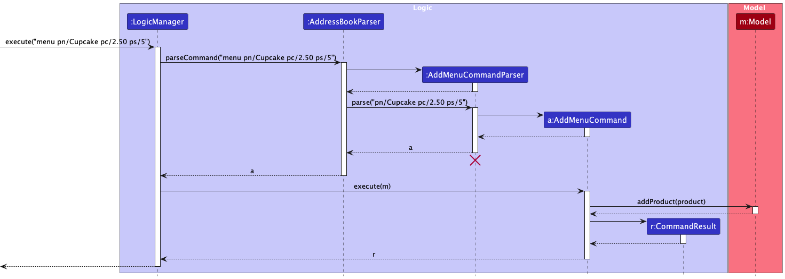

The `AddMenuCommand` class which extends the `Command` abstract class will be executed by the `LogicManager` which will update the `Product Menu` in the `Model`.

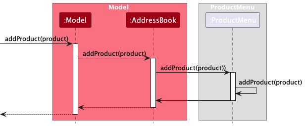

After parsing the `menu` command, the `LogicManager` will call the `Model#addProduct(id)` which calls `AddressBook#addProduct(id)`. The `addProduct` of `ProductMenu` will then be called, which will add a new product to the `ArrayList<Product>`.

### Delete a product from menu feature

#### Implementation

Deletes a `Product` from the menu. Example: `delete m/1`. The sequence of events are illustrated by the diagram below, starting with the parsing of the command.

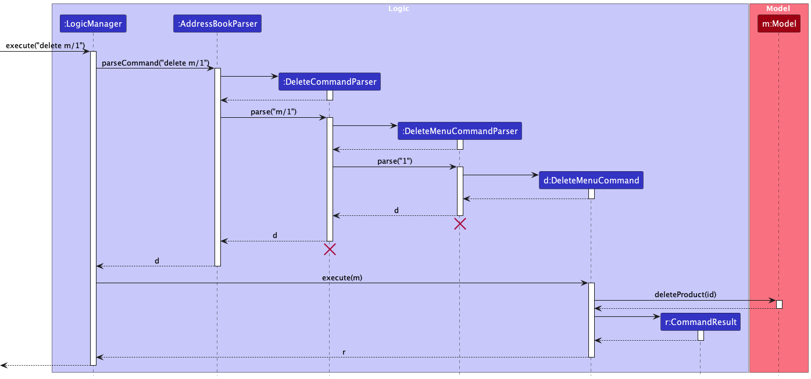

The `DeleteMenuCommand` class which extends the `Command` abstract class will be executed by the `LogicManager` which will update the `Product Menu` in the `Model`.

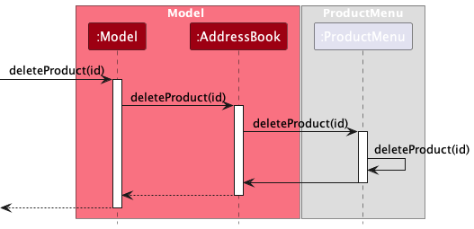

After parsing the `menu` command, the `LogicManager` will call the `Model#deleteProduct(id)` which calls `AddressBook#deleteProduct(id)`. The `deleteProduct` of `ProductMenu` will then be called, which deletes a product from the `ArrayList<Product` according to the specified `MENU_ID`.

`DeleteCommandParser` will construct the respective command based on the accompanying prefixes:
1. If `PREFIX_MENU`, a `DeleteMenuCommand` will be created.
2. If `PREFIX_CUSTOMER_ID`, a `DeleteCustomerCommand` will be created.

### Edit a product in the menu feature

#### Implementation

Edits a `Product` on the menu. Example: `edit m/1 pn/Pie`. The `edit` command works in a similar way as the `delete` command.

`EditCommandParser` will construct the respective command based on the accompanying prefixes:
1. If `PREFIX_MENU`, a `EditMenuCommand` will be created.
2. If `PREFIX_CUSTOMER_ID`, a `EditCustomerCommand` will be created.
3. If `PREFIX_ORDER_ID`, an `EditOrderCommand` will be created.

### Stage order feature

#### Implementation

Moves an order to the next stage, in the chain of the four stages, in order namely: `Under Preparation`, `Ready for Delivery`,
`Sent for delivery` and `Received by customer`. However, you cannot go back to a previous stage.

Example: `stage o/1`

The sequence of events are illustrated by the diagram below, starting with the parsing of the command.
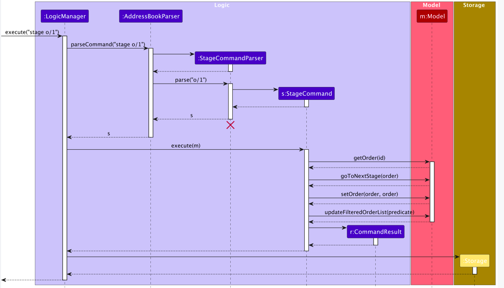

The `StageCommand` class which extends the `Command` abstract class will be executed by the `LogicManager` which will update the `addressBook` in the `Model`.
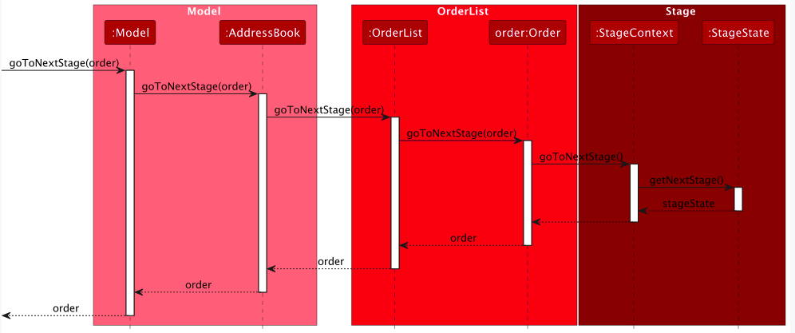

### Known Limitations
1. As `StringUtil#containsWordIgnoreCase` searches by entire word, searching for `945` in `94567122` for `Phone` will result in false. This is also consistent in `Email`.

2. Only one `PREFIX` can be chosen to filter by. Future improvements may include searching from more than one `PREFIX`. Example: `find o/19 n/John a/Lorong`.

### Completing Order Feature

#### Implementation

Data archiving of completed orders is achieved by creating a `CompleteOrderCommand` with the user input, Example `complete 1`
, which will remove the order from the active order list and place it in a completed order list which will be saved as a csv file.
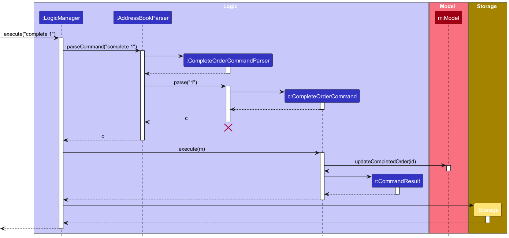
The `CompleteCommand` class which extends the `Command` abstract class will be executed by the `LogicManager` which will
update the Active Order List and Completed Order List in the `Model`.
This is done by placing the completed `Order` in the completed order list to be collected by the `StorageManager` in the
next step.
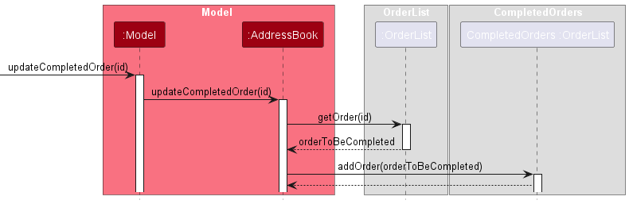
The StorageManager will then store the Orders inside of the Completed Order List as a csv file in this directory: 
`[JAR file location]/data/completedorders.csv`, compiling all previously completed orders.

--------------------------------------------------------------------------------------------------------------------

## **Documentation, logging, testing, configuration, dev-ops**

* [Documentation guide](Documentation.md)
* [Testing guide](Testing.md)
* [Logging guide](Logging.md)
* [Configuration guide](Configuration.md)
* [DevOps guide](DevOps.md)

--------------------------------------------------------------------------------------------------------------------

## **Appendix: Requirements**

### Product scope

**Target user profile**:

* Home-Based Food Business Owners who sell their products online
* has a need to manage a significant number of customer contacts
* has a need to track the food order to the contact
* prefer desktop apps over other types
* can type fast
* prefers typing to mouse interactions
* is reasonably comfortable using CLI apps

**Value proposition**: The address book can help homemade food sellers organize customer information and orders
so that they know what to bake, how much to bake and where to deliver the order to. This information management
tool aims to be more efficient to use than paper-work or general-purpose excel sheets. We also aim to reduce
chances of mistakes such as wrong delivery address, forgetting an order or sending repeated orders.

### User stories

Priorities: High (must have) - `* * *`, Medium (nice to have) - `* *`, Low (unlikely to have) - `*`

| Priority | As a …​                    | I want to …​                                                                | So that I can…​                                                                                            |
|----------|----------------------------|-----------------------------------------------------------------------------|------------------------------------------------------------------------------------------------------------|
| `* * *`  | new user                   | see a list of all main functionalities                                      | know what I can do with the app                                                                            |
| `* * *`  | new user                   | check the explanation of all functions                                      | know what the commands mean                                                                                |
| `* * *`  | second time user           | retrieve data I entered last time                                           |                                                                                                            |
| `* * *`  | forgetful user             | see usage instructions                                                      | refer to instructions when I forget how to use the App                                                     |
| `* * *`  | seller                     | add new contacts into the program                                           | keep information of customers                                                                              |
| `* * *`  | seller                     | remove contacts from the program                                            | remove information of customers that I no longer do business with                                          |
| `* * *`  | seller                     | find a customer by name                                                     | locate details of persons without having to go through the entire list                                     |
| `* * *`  | seller                     | create orders for contacts                                                  | know what customers have purchased                                                                         |
| `* * *`  | seller                     | mark an order as done                                                       | distinguish between orders done and not done yet                                                           |
| `* *`    | new user                   | see sample data                                                             | see what the app looks like when it is in use and try out the functions hands-on                           |
| `* *`    | seller                     | edit orders                                                                 | update orders when customers change them                                                                   |
| `* *`    | seller                     | update the contact information                                              | correct mistakes made by me and users when keying in information, and update when users change information |
| `* *`    | seller                     | archive completed orders                                                    | track past orders for accounting purposes                                                                  |
| `* *`    | seller                     | mark the stage of an order                                                  | track the status of each order precisely                                                                   |
| `* *`    | busy seller                | type the commands fast using shortcuts                                      | save time and improve work efficiency                                                                      |
| `* *`    | seller with many customers | search for users who have existing orders                                   | better fulfill the orders                                                                                  |
| `*`      | seller                     | track the number of orders each address has                                 | double check for any discrepancies                                                                         |
| `*`      | seller                     | track which deliveries are handed by which postman                          | know who to approach if there is any issue                                                                 |
| `*`      | seller                     | mark select a bunch of orders as to be delivered together in the next round |                                                                                                            |
| `*`      | seller                     | hide private contact details                                                | minimize chance of leakage of customer information by accident                                             |
| `*`      | busy seller                | get auto-suggestions as I type                                              | type fast and work efficiently                                                                             |
| `*`      | seller with many customers | sort customer by name                                                       | locate a person easily                                                                                     |
| `*`      | careless user              | undo delete commands                                                        | recover information I accidentally deleted by mistake                                                      |
| `*`      | careless user              | get a double confirmation warning before I delete anything                  | reduce chance of deleting information by mistake                                                           |

### Use cases

(For all use cases below, the **System** is the `Strack.io` and the **Actor** is the `user`, unless specified otherwise)

**Use case: UC1 - Adding a contact**

**MSS**

1.  User chooses to add a new customer and specifies the required details.
2.  Strack.io displays the added customer contact.

    Use case ends.

**Extensions**

* 1a. Strack.io detects an error in the entered data.
    * 1a1. Strack.io shows the missing/incorrect field.
    * 1a2. User enters new data.

        Steps 1a1-1a2 are repeated until the data entered are correct.

        Use case resumes from step 2.

**Use case: UC2 - Delete a contact**

**MSS**

1.  User requests to list persons.
2.  Strack.io shows a list of persons.
3.  User requests to delete a specific person in the list
4.  Strack.io deletes the contact, displaying the deleted contact.

    Use case ends.

**Extensions**

* 2a. The list is empty.

  Use case ends.

* 3a. The given index is invalid.

    * 3a1. Strack.io shows an error message.

      Use case resumes at step 2.

* 3b. The customer at the given index has an existing order.

    * 3b1. Strack.io shows an error message.

      Use case resumes at step 2.

**Use case: UC3 - Edit a contact**

**MSS**

1.  User requests to list persons.
2.  Strack.io shows a list of persons.
3.  User requests to edit the details of a specific person in the list.
4.  Strack.io edits the details of the person and displays the new contact.

    Use case ends.

**Extensions**

* 2a. The list is empty.

  Use case ends.

* 3a. The given index is invalid.

    * 3a1. Strack.io shows an error message.

      Use case resumes at step 2.

* 3b. Strack.io detects an error in the entered data.
    * 3b1. Strack.io shows the missing/incorrect field.
    * 3b2. User enters new data.

        Steps 3b1-3b2 are repeated until the data entered are correct.

        Use case resumes from step 4.

**Use case: UC4 - Searching for a contact**

**MSS**

1.  User requests to search for contact based on keyword.
2.  Strack.io shows a list of matching persons.

    Use case ends.

**Extensions**
* 2a. The list of matching persons is empty.

  Use case ends.

**Use case: UC5 - Setting up a Product Menu**

**MSS**

1.  User uses Strack.io to populate the product menu with products
sold by the user.
2.  Strack.io displays the added products in the menu.

    Use case ends.

**Extensions**

* 1a. Strack.io detects an error in the entered data.
    * 1a1. Strack.io shows the missing/incorrect field.
    * 1a2. User enters new data.

      Steps 1a1-1a2 are repeated until the data entered are correct.

      Use case resumes from step 2.

**Use case: UC6 - Creating an order**

**MSS**

1.  User populates the Strack.io Menu with his/her products (UC5)
2.  User chooses to create an order for an existing person and specifies the required details.
3.  Strack.io displays the added order.

    Use case ends.

**Extensions**

* 1a. Strack.io detects an error in the entered data.
    * 1a1. Strack.io shows the missing/incorrect field.
    * 1a2. User enters new data.

      Steps 1a1-1a2 are repeated until the data entered are correct.

      Use case resumes from step 2.

**Use case: UC7 - Edit an order**

**MSS**

1.  User requests to list orders.
2.  Strack.io shows a list of orders.
3.  User requests to edit the details of a specific order in the list.
4.  Strack.io edits the details of the order and displays the new order.

    Use case ends.

**Extensions**

* 2a. The list is empty.

  Use case ends.

* 3a. The given index is invalid.

    * 3a1. Strack.io shows an error message.

      Use case resumes at step 2.

* 3b. Strack.io detects an error in the entered data.
    * 3b1. Strack.io shows the missing/incorrect field.
    * 3b2. User enters new data.

      Steps 3b1-3b2 are repeated until the data entered are correct.

      Use case resumes from step 4.

**Use case: UC8 - Cancelling an order**

**MSS**
1. User requests to cancel a specific order by index.
2. Strack.io cancels the order.

    Use case ends.

**Extensions**

* 1a. The given index is invalid.

    * 1a1. Strack.io shows an error message.

      Use case ends.

**Use case: UC9 - Completing an order**

**MSS**
1. User has completed the production and delivery of an order.
2. User can use Strack.io to complete the order.
3. User can access the `data/completedorder.csv` file to see past completed
orders in excel.

   Use case ends.

**Extensions**

* 2a. The given index is invalid.

    * 2a1. Strack.io shows an error message.

      Use case ends.

**Use case: UC10 - Searching for an order**

**MSS**
1. User searches for orders by indexes
2. Strack.io shows orders with corresponding indexes

    Use case ends.

**Extensions**
* 2a. The list of matching orders is empty.

    Use case ends.

### Non-Functional Requirements

1.  Should work on any _mainstream OS_ as long as it has Java `11` or above installed.
2.  Should be able to hold up to 10000 contacts and 500 active orders without a noticeable sluggishness in performance for typical usage.
3.  A user with above average typing speed for regular English text (i.e. not code, not system admin commands) should be able to accomplish most of the tasks faster using commands than using the mouse.
4.  Even when the app quits unexpectedly in run time, most information updated in the current session should not be lost when the app re-launches.
5.  Should protect sensitive customer information so that they are not leaked to possible malware on the same device.
6.  The user interface should look clean and organised even when it is populated with a lot of information.
7.  The response time to any action other than fetching archived order history should be within 1 second.

### Glossary

* **Mainstream OS**: Windows, Linux, Unix, MacOS
* **Private contact detail**: A contact detail that is not meant to be shared with others
* **Sensitive customer information**: Customer's name, email, phone number, address and any other personal information which is saved locally in this app

--------------------------------------------------------------------------------------------------------------------
## **Appendix: Planned Enhancements**

Team Size: 5
### Limit input of cost and sales
* Currently, the input of cost and sales of product can be negative, or very high until Infinity is reached.
* Future plans is to add boundaries and limit the pricing to be between 0 inclusive and 1 billion.

### Limit Phone number
* Currently, the phone number is minimally of length 3.
* As this product is created mainly for Singaporeans, future enhancement is to increase limit to 8, which is the norm in
Singapore. This will prevent errors where phone number of length 7 is entered but gone unnoticed.

### Allow duplicate customer names
* Currently, customers entered cannot have the same name. However, most commands are either done with phone number or
CUSTOMER_ID, future plans would allow for duplicate customer names.

### Restrict deadline dates to be after creation date
* Currently, deadline dates can be set to be before order creation date. Future plans will fix so that it can only be
after.

### Allow customer names to contain slash and other legal non-alphanumeric characters
* Currently, sequence of characters like s/o is not allowed as a valid input. Future tweaks will allow for more
flexibility in names.

### Allow text-wrapping when characters are too long
* Currently, when certain values are too long like product names, text will overflow out of the app instead of going to
a new line. Future fixes will allow text-wrapping into a new line.

### Disallow duplicate phone numbers for different customers
* Currently, duplicate phone numbers is not checked for. If different customers share a phone number, order from that
phone number will be added to the first customer in the contact list.
* In the future, we will check phone number against existing contact list when adding new customers, so as to remove such ambiguities.

--------------------------------------------------------------------------------------------------------------------
## **Appendix: Instructions for manual testing**

Given below are instructions to test the app manually.

:information_source: **Note:** These instructions only provide a starting point for testers to work on;
testers are expected to do more *exploratory* testing.

### Launch and shutdown

1. Initial launch

   1. Download the jar file and copy into an empty folder

   1. Double-click the jar file Expected: Shows the GUI with a set of sample contacts. The window size may not be optimum.

1. Saving window preferences

   1. Resize the window to an optimum size. Move the window to a different location. Close the window.

   1. Re-launch the app by double-clicking the jar file. 
       Expected: The most recent window size and location is retained.

### Adding a person
1. Adding a person  
   2. Test case: `add n/Jackson p/12345678 a/NUS e/jackson@gmail.com`
   Expected: Contact named Jackson is added to the customer list. Details of the added contact shown in the status message and in the list.

### Deleting a person

1. Deleting a person while all persons are being shown

   1. Prerequisites: List all persons using the `list` command. Multiple persons in the list.

   1. Test case: `delete c/1` 
      Expected: First contact is deleted from the list. Details of the deleted contact shown in the status message. Timestamp in the status bar is updated.

   1. Test case: `delete c/0` 
      Expected: No person is deleted. Error details shown in the status message. Status bar remains the same.

   1. Other incorrect delete commands to try: `delete`, `delete x`, `...` (where x is larger than the list size) 
      Expected: Similar to previous.

### Adding a product
1. Adding a product to the menu
   2. Test case: `menu pn/Cupcake pc/3 ps/4` 
   Expected: Product named Cupcake is added to the product list with the corresponding MENU_ID.
   3. Test case: `menu pn/Tart pc/a ps/b` 
   Expected: No product is added. Error details shown in the status message.

### Adding an order
1. Adding an order
   2. Prerequisites: There must at least be one product in the menu and one customer in the customer list.
   3. Test case: `order p/12345678` 
   Expected: No order is added yet. Instructions to add product to order in status message.
   4. Test case: `product m/1 pq/5` 
   Expected : Order is added to order list and under the corresponding customer. Order in order list includes details of order.
   
### Cancelling an order
1. Cancelling an order that will not be fulfilled
   2. Test case `cancel 1` 
   Expected: First order is deleted from the order list. ORDER_ID of the cancelled order shown in the status message.
   3.  Test case: `cancel 0` 
   Expected: No order is deleted from the order list. Error details shown in the status message.

### Completing an order
1. Completing an order that have been fulfilled
   2. Prerequisites: `completedorders.csv` file must not be open.
   3. Test case: `complete 1` 
   Expected: Order is deleted from the order list. ORDER_ID of the completed order is shown in the status message.
   Details of the order is logged in `data/completedorders.csv` file.

### Staging an order
1. Staging an order that have been placed
   2. Prerequisites: There must be existing orders in the order list.
   3. Test case: `stage o/1` 
   Expected: Stage of order changes from `Under Preparation` to `Ready For Delivery`. Details of staged order in status
   message.
   4. Test case: `stage o/1` 
   Expected: Stage of order changes from `Ready For Delivery` to `Sent For Delivery`. Details of staged order in status
   message. 
   5. Test case: `stage o/1` 
   Expected: Stage of order changes from `Sent For Delivery` to `Received By Customer`. Details of staged order in 
   status message.

### Finding an order
1. Finding an order in the order list
   2. Prerequisites: There must be existing orders in the order list.
   3. Test case: `find o/1 o/3` 
   Expected: Order 1 and 3 is listed in the order list. Number of orders listed in the status message.

### Finding a customer
1. Finding an customer in the customer list
   2. Prerequisites: There must be existing customers in the customer list.
   3. Test case: `find p/12345678` 
   Expected: Contact with phone `12345678` listed in the customer list. Number of customers listed in the status message.

### Deleting a product
1. Deleting a product in the menu

    1. Prerequisites: There must be existing products in the menu.
    1. Test case: `delete m/1` 
       Expected: First product is deleted from the list. Details of the deleted product shown in the status message.
    1. Test case: `delete m/0` 
       Expected: No product is deleted. Error details shown in the status message.

### Editing an order
1. Editing an order in the order list
   2. Prerequisites: There must be existing orders in the order list.
   3. Test case: `edit o/1 m/1 pq/5` 
   Expected: 5 x Product 1 is added to Order 1. Details of edit shown in the status message.
   4. Test case: `edit o/1 m/1 pq/0` 
   Expected: Product 1 is removed from Order 1. Details of edit shown in the status message.
   
### Editing a product
1. Editing a product in the menu
   2. Prerequisites: There must be existing products in the menu.
   3. Test case: `edit m/1 pn/Eggtart` 
   Expected: Product 1 is renamed to `Eggtart`. Details of edit shown in the status message.
   4. Test case: `edit m/1 pc/4` 
   Expected: Cost of product 1 is changed to $4. Details of edit shown in the status message.
   5. Test case: `edit m/1 ps/5` 
   Expected: Sales of product 1 is changed to $5. Details of edit shown in the status message.

--------------------------------------------------------------------------------------------------------------------
## **Appendix: Effort**

Being the first delve into team-based software engineering for many of us in the group, the difficulty
level for our project was relatively high. This was one of the many factors that made the difficulty much 
higher than expected.

Another major challenge was overambition. For many of us, we went into CS2103 without seeking any tips and
advice from our peers and seniors. This led to us being unable to compare and judge the estimated effort 
other groups and batches put in. This led to us over estimating our ability to organise and implement a
large number of complex features. This is especially so when we consider the busy
schedule of everyone in the group.

Another major hurdle for our group is coordination and communication. Having to create many functions and
classes that have co-dependecies with each other. It was quite challenging to incorporate elements of each
others code as many of our features rely on each other to work correctly and efficiently. Sometimes,
we required each other's guidance to help understand the how their code will work with our own code and how to
incorporate it into other features and to ensure that all the traits a customer,order or product
should have are properly updated, deleted and added.

Despite the hurdles and challenges faced, we all put in extra effort and time despite our busy schedules to 
hold meetings, review others' code and comment on how we could improve our designs.

Glad to say, we have achieved more than what we expected, we were able to implement most of the features we 
wanted for the entire project in v1.2. We then came up with new features to further improve Strack that 
were outside our original set of features. After all of that, we could say that we were proud of the end product
and effort that we put into this project.
